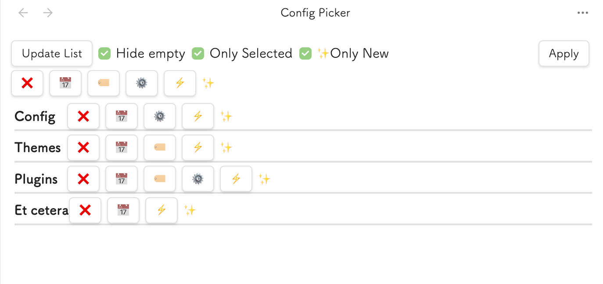
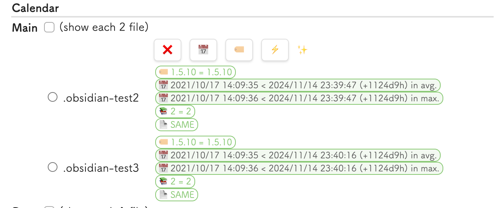

# Usher: Config Manager for Overridden Directories

Manages multiple .obsidian directories efficiently.

## How to use

1. Install this plugin from [BRAT](https://github.com/TfTHacker/obsidian42-brat)
2. Type `Show Usher` in the command palette
3. The Usher pane will be displayed!

## Features

### Buttons and checkboxes

| Name          | Behaviour                                                                     |
| ------------- | ----------------------------------------------------------------------------- |
| Update List   | Update the list                                                               |
| Hide empty    | Hide entries with no candidates                                               |
| Only Selected | Show only the selected entry (Used with Automatic Selection Buttons)          |
| Only New      | Limit automatic selection only to newer entries than the current device's one |
| Apply         | Apply the selected entry to the current device                                |

### Automatic Selection Buttons

These buttons are automatically selected to apply to the current device.
They are also displayed by category. They only affect the selected category.

| Name | Behaviour                                               |
| ---- | ------------------------------------------------------- |
| ❌    | Clear the selection                                     |
| 📅    | Select the most recently modified                       |
| 🏷️    | Select latest version (Theme and Plugins only)          |
| ⚙    | Select different content (JSON only, after merged) [^1] |
| ⚡    | Select modified and latest file (Mostly for snippets)   |

[^1]: JSON files will be merged with the current one.

### How to read the difference report

- When it is thin coloured, it means the file will not be valuable to be applied.
  - For example, the file is the same as the current one, or it is older in version or modification date than the current one.
- When it is thick coloured (like tags), it means the file will be valuable to apply.
  - For example, the file is newer (version or modified) than the current one.
- Automatic selection will follow your preference from the thick coloured files.
- If you want to include the thin coloured file, you should uncheck the `Only New` checkbox.
- On default, only the selected entry will be displayed. If you want to see all entries, you should uncheck the `Only Selected` checkbox.
- Once you have made a selection and are ready to apply it, you should click the `Apply` button.

## Configuration

### Ignore files
We can configure the files to be ignored by the Usher in regular expression.
The default value is `/node_modules$` and `/.git$`.

### Non-mergeable files
We can configure the files to be non-mergeable by the Usher in regular expression.
The default value is `/bookmarks.json$`.

### Utility
- Duplicate Config folder
  - Duplicate the current config folder to the new folder.
  - Very useful when you want to create a new config folder based on the current one.
- Delete Other devices' config folder
  - This action is tremendously dangerous, but sometimes useful. This action will delete the selected config folders.
  - We cannot select the current device's folder.
  - Deleted files will be moved to the trash.
